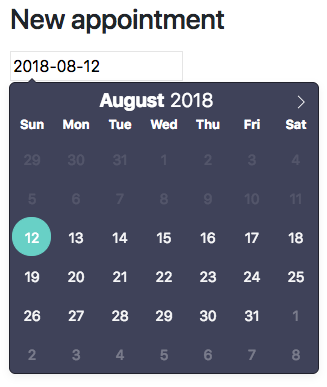
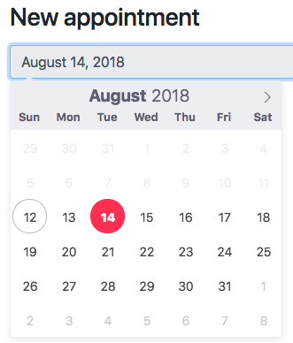

# Stimulus Flatpickr

### A modest wrapper of Flatpickr for Stimulus

This is a wrapper of [Flatpickr](http://flatpickr.js.org/) for Stimulus.js. All configurations for the DateTime picker can be set directly from the `data-attributes` of the HTML. This makes it very handy to pass information from the backend to the datepicker.

An example of a Rails app showcasing a localized date picker with availabilities is available here :
[Rails Stimulus Flatpickr]()

## Install

This assumes that you have [Stimulus](https://stimulusjs.org/handbook/installing) already installed.

In your project add the `stimulus-flatpickr`and `flatpickr` module.

```bash
$ yarn add stimulus-flatpickr flatpickr
```

or

```bash
$ npm i stimulus-flatpickr flatpickr
```

## Basic usage

If you only need to convert an input field in a DateTime picker, you just need to register a standard Stimulus controller and add some markup to your input field.

#### Register a Flatpickr Controller

manually register a new stimulus controller in your main js entry point.

```js
// ./packs/application.js
import { Application } from "stimulus";
// import Flatpickr
import Flatpickr from "stimulus-flatpickr";

import { definitionsFromContext } from "stimulus/webpack-helpers";
const application = Application.start();
const context = require.context("../controllers", true, /\.js$/);
application.load(definitionsFromContext(context));

// Manually register Flatpickr as a stimulus controller
application.register("flatpickr", Flatpickr);
```

#### Using it with Rails

You can now create forms and input fields easily by adding a `data-controller="flatpickr"` attribute to the input fields and pass [options](https://flatpickr.js.org/options/) with the Stimulus Controller states : `data-flatpickr-the-option`.

```html+erb
<%= form_with model: Appointement.new, authenticity_token: true do |f| %>
  <%= f.text_field :start_time,
    data: {
      controller: "flatpickr",
      flatpickr_format: "Y-m-d",
      flatpickr_min_date: Time.zone.now
    } %>
<% end %>
```

👇👇👇👇👇👇


#### Options & conventions

All options for Flatpickr can be found [here](https://flatpickr.js.org/options/).

All options are in `camelCase` (JS) and must be converted to `lower_snake_case` in the `data-attribute`. `lower_snake_case` is automatically converted to `kebab-case` when rails render the HTML.

```erb
<%= f.text_field :start_time,
  data: {
    controller: "flatpickr",
    flatpickr_enable_time: true
  }
} %>
```

will output this HTML:

```html
<input data-controller="flatpickr" data-flatpickr-enable-time="true" type="text" name="appointement[start_time]" >
```

#### HTML markup

If you are not using Rails or simply wants to markup your HTML directly, simply add a `html data-controller="flatpickr"` to your input field and some options `html data-flatpickr-some-option="value"` options must be converted from `camelCase` to `kebab-case`

## Advanced Usage

If you need more than just displaying the standard DateTime picker, then you can extend the `stimulus-flatpickr` wrapper controller. This is necessary when you need to:

- set a custom language
- create customs callbacks
- perform JS business logic

**Skip basics installation steps from above!**

### Extends the controller

create a new Stimulus controller that will inherit from `stimulus-flatpickr`

```js
// ./controllers/flatpickr_controller.js
// import stimulus-flatpickr wrapper controller to extend it
import Flatpickr from "stimulus-flatpickr";

// you can also import a translation file
import { French } from "flatpickr/dist/l10n/fr.js";

// import a theme (could be in your main CSS entry too...)
import "flatpickr/dist/themes/dark.css";

// create a new Stimulus controller by extending stimulus-flatpickr wrapper controller
export default class extends Flatpickr {
  initialize() {
    // sets your language (you can also set some global setting for all time pickers)
    this.config = {
      locale: French
    };
  }

  // all flatpickr hooks are available as callbacks in your Stimulus controller
  change(selectedDates, dateStr, instance) {
    console.log("the callback returns the selected dates", selectedDates);
    console.log("but returns it also as a string", dateStr);
    console.log("and the flatpickr instance", instance);
  }
}
```

### HTML markup

Then in the same way as above you can now create forms and input fields easily by adding a `data-controller="flatpickr"` attribute to the input fields and pass [options](https://flatpickr.js.org/options/) with the Stimulus Controller states : `data-flatpick-the-option`.

```html+erb
<%= form_with model: Appointement.new, authenticity_token: true do |f| %>
  <%= f.text_field :start_time,
    data: {
      controller: "flatpickr",
      flatpickr_format: "Y-m-d",
      flatpickr_min_date: Time.zone.now
    } %>
<% end %>
```

👇👇👇👇👇👇



### Date and Time formats

Flatpickr has custom [formatting tokens](https://flatpickr.js.org/formatting/). in Rails (and other backends) formats are based on `strftime` standard.

This package automatically converts `strftime`datetime formats to the nearest Flatpickr format.

With this solution it become handy to localize your date formats.

```erb
<%= form_with model: appointment do |f| %>
  <%= f.text_field :start_at,
      data: {
        controller: "flatpickr",
        flatpickr_alt_format: t("date.formats.long"),
        flatpickr_alt_input: true,
        flatpickr_min_date: Time.zone.now,
      } %>
<% end %>
```

👇👇👇👇👇👇



### Callbacks

All Flatpickr [events/hooks](https://flatpickr.js.org/events/) are available as callbacks in the extended controller as demonstrated above for the `onChange` hook.

Just add the function to your Stimulus Controller in `camelCase` without `on`.

`onChange` -> `change(){}`

### Getters

#### Elements

In your controller you can access the Flapickr [elements](https://flatpickr.js.org/instance-methods-properties-elements/#elements) using some Stimulus like targets.

`this.inputTarget` : The text input element associated with flatpickr.

`this.calendarContainerTarget` : Self-explanatory. This is the div.flatpickr-calendar element.

`this.prevMonthNavTarget` : The “left arrow” element responsible for decrementing the current month.

`this.nextMonthNavTarget` : The “right arrow” element responsible for incrementing the current month.

`this.currentMonthElementTarget`: The span holding the current month’s name.

`this.currentYearElementTarget`: The input holding the current year.

`this.daysTarget` : The container for all the day elements.

#### Properties

....

## CSS

This wrapper does not include any CSS. Flatpickr CSS should be loaded separately from the main Flatpickr package as you would normally do.

## Contributing

Bug reports and pull requests are welcome on GitHub at https://github.com/adrienpoly/stimulus-flatpickr. This project is intended to be a safe, welcoming space for collaboration, and contributors are expected to adhere to the Contributor Covenant code of conduct.

## License

This package is available as open source under the terms of the MIT License.
