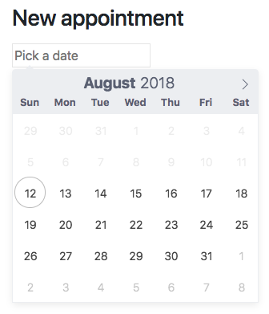

# Stimulus Flatpickr

### A modest wrapper of Flatpickr for Stimulus

This in an experimental wrapper on Flatpickr for using Stimulus.js. all configurations for the datetime picker can be set directly from the `data-attributes` of the HTML. This can be handly when working as an example with a Rails backend so that all settings for the DateTime picker can be set by the backend when generating the view.

### Install

This assumes that you have [Stimulus](https://stimulusjs.org/handbook/installing) and [Flatpickr](https://flatpickr.js.org/) already installed.

In your project add the stimulus Flatpickr npm module.

`$ yarn add stimulus-flatpickr`

or

`$ npm i stimulus-flatpickr`

### Basic usage

If you only need to convert an input field in a DateTime picker you just need to register a standard Stimulus controller and add some markup to you input field.

##### Register Flatpickr Controller

manually register a new stimulus controller in your main js entry point.

```js
// ./packs/application.js
import { Application } from "stimulus";
// import Flatpickr
import Flatpickr from "stimulus-flatpickr";

import { definitionsFromContext } from "stimulus/webpack-helpers";
const application = Application.start();
const context = require.context("../controllers", true, /\.js$/);
application.load(definitionsFromContext(context));

// Manually register Flatpickr as a stimulus controller
application.register("flatpickr", Flatpickr);
```

##### Using in Rails

You can now create forms and input fields easily by adding a `data-controller="flatpickr"` attribute to the input fields.

```html+erb
<%= form_with model: Appointement.new, authenticity_token: true do |f| %>
  <%= f.text_field :start_time,
    data: {
      controller: "flatpickr",
      flatpickr_enable_time: true,
      flatpickr_format: "Y-m-d H:i",
      flatpickr_minute_increment: 30,
      flatpickr_max_date: Time.zone.now + 3.days
    } %>
<% end %>
```

Will generate:



All options for Flatpickr can be found [here](https://flatpickr.js.org/options/).

All options are in `camelCase` (JS) and must be converted to `lower_snake_case` in the `data-attribute`. `lower_snake_case` are automaticcally converted to `kebab-case` when rails renders the html.

```erb
<%= f.text_field :start_time,
  data: {
    controller: "flatpickr",
    flatpickr_enable_time: true
  }
} %>
```

will output this HTML:

```html
<input data-controller="flatpickr" data-flatpickr-enable-time="true" type="text" name="appointement[start_time]" >
```

##### HTML markup

If you are not using Rails or simply wants to markup your HTML directly, simply add a `html data-controller="flatpickr"` to your input field and some options `html data-flatpickr-some-option="value"` options must be converted from `camelCase` to `kebab-case`

### Advanced

coming...

### Localize

coming...

### Contributing

Bug reports and pull requests are welcome on GitHub at https://github.com/adrienpoly/stimulus-flatpickr. This project is intended to be a safe, welcoming space for collaboration, and contributors are expected to adhere to the Contributor Covenant code of conduct.

### License
This package is available as open source under the terms of the MIT License.

